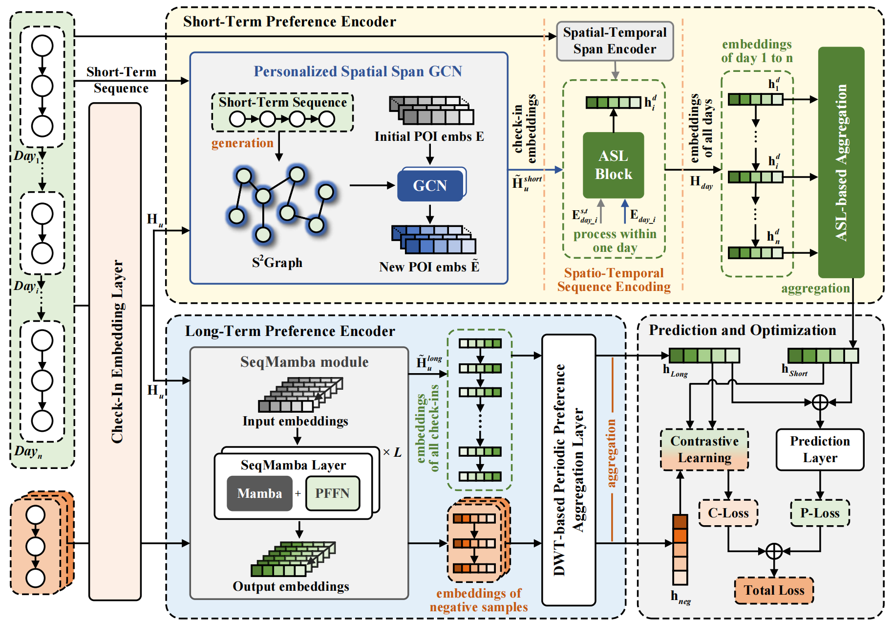

# Introduction

This is the pytorch implementation of paper "Personalized Short-term and Periodic Long-term Preferences Modeling with Contrastive Learning for Next POI Recommendation"




## Requirements

```
torch                     2.2.0
torch_geometric           2.5.3
torch-scatter             2.1.1
torch-sparse              0.6.17
torchvision               0.17.0
numpy                     1.23.5
pandas                    2.0.3
```

## Train

Train and evaluate the model using python `Main.py`.
